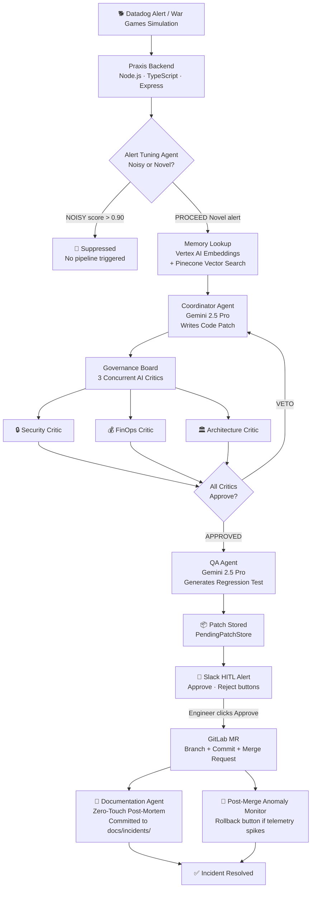

# PRAXIS — Autonomous AI Site Reliability Engineer

> **"Stop waking up engineers at 2 AM. Let Praxis fix it."**

[](LICENSE)
[](https://deepmind.google/technologies/gemini/)
[](https://cloud.google.com/vertex-ai)
[](https://pinecone.io)
[](https://gitlab.com)

---

## The Problem

Production incidents are expensive, chaotic, and exhausting.

The average **Mean Time to Recovery (MTTR)** for a P1 incident is **4.2 hours**. During that window, engineers are paged at 3 AM, scrambling through runbooks, copy-pasting stack traces into Slack, and manually writing patches under pressure. The process is slow, error-prone, and a primary driver of **developer burnout**.

**Praxis eliminates this entirely.**

---

## What is Praxis?

Praxis is a fully autonomous AI SRE that intercepts production alerts, reasons about them using vector memory, writes a verified code patch, audits it through a multi-agent Governance Board, and delivers a one-click approval to the on-call engineer in Slack — all before they've had time to open their laptop.

The entire resolution lifecycle, from alert to merge-ready patch, is **zero-touch ChatOps**.

---

## 🏗 Architecture



---

## ⚡ Key Features

### 🧠 Vector Memory — "Has Praxis seen this before?"
Every resolved incident is embedded with **Vertex AI `text-embedding-004`** and stored in **Pinecone**. When a new alert arrives, the Alert Tuning Agent queries for cosine similarity. If a match scores above **0.90**, the alert is classified as `NOISY` and suppressed — no redundant pipelines, no alert fatigue.

### 🤖 Autonomous Patch Generation
The **Coordinator Agent** (Gemini 2.5 Pro) receives the raw trace log, any similar past patches from memory, and any Governance Board feedback, then writes a complete, production-ready code patch with file paths and content.

### 🏛 Multi-Agent Governance Board
Three independent AI critics run **concurrently** before any patch is approved:

| Critic | Focus |
|---|---|
| 🔒 Security | CVEs, injection risks, auth bypass surface area |
| 💰 FinOps | Compute cost regressions, unnecessary resource allocation |
| 🏛 Architecture | Blast radius, coupling, scalability trade-offs |

If any critic issues a **VETO**, structured feedback is passed back to the Coordinator for a revised patch (up to 2 retry loops).

### 🧪 Automated QA
A dedicated **QA Agent** (Gemini 2.5 Pro) reads the approved patch and writes a regression test file, committed alongside the fix in the GitLab MR.

### 💬 Slack-First Human-in-the-Loop (HITL)
The entire workflow surfaces in Slack. The on-call engineer sees:
- Full incident summary and Governance Board ratings
- One-click **Approve** or **Reject** buttons

Clicking **Approve** triggers GitLab MR creation, post-mortem generation, and anomaly monitoring — all automatically.

### 📄 Zero-Touch Post-Mortems
The **Documentation Agent** generates a structured incident runbook in Markdown and commits it directly to `docs/incidents/<incidentId>.md` in the repository. No manual write-up required.

### 🚨 War Games Simulation
A built-in `/api/wargames/initiate` endpoint injects a synthetic Stripe `TimeoutError` payload — complete with realistic p99 latency data, error rates, and revenue impact — to stress-test the full pipeline on demand. Trigger it from the dashboard or via `curl`.

---

## 🛠 Sponsor Technologies

| Layer | Technology | How We Used It |
|---|---|---|
| **Alert Ingestion** | **Datadog** | Webhook receiver for production latency spikes; War Games synthetic anomaly injection that mirrors real Datadog alert payloads with p99 latency, error rate, and revenue-at-risk fields |
| **Embeddings** | **Google Cloud Vertex AI** (`text-embedding-004`) | Generate 768-dimensional vectors from raw trace logs for both the alert noise filter and the incident memory lookup |
| **Vector Memory** | **Pinecone** | Store resolved incident embeddings; powers the Alert Tuning Agent's similarity search — alerts above 0.90 cosine score are suppressed as noise |
| **Core LLM** | **Gemini 2.5 Pro** | Patch generation, all three Governance Board critics, QA regression test generation, and post-mortem documentation — four separate agent roles, one model |
| **SCM / CI** | **GitLab** | Automated branch creation, file commits, and MR creation via GitLab REST API on engineer approval from Slack |
| **ChatOps** | **Slack** | Full HITL approval flow with Block Kit buttons; post-merge anomaly alerts with one-click Rollback; post-mortem commit notifications |
| **Frontend Hosting** | **Vercel** | Production deployment of the React + Vite "Cognitive Stream" dashboard |
| **Backend Hosting** | **Render** | Production deployment of the Node.js/TypeScript Express webhook backend |

---

## 🔁 End-to-End Flow

```
1. Datadog fires a latency alert  →  POST /api/webhooks/datadog/warning
2. Alert Tuning Agent embeds the alert text via Vertex AI
3. Pinecone query checks for similar past incidents (threshold: 0.90)
   → NOISY?   Suppressed. Pipeline halted.
   → PROCEED? Continue.
4. Coordinator Agent (Gemini 2.5 Pro) writes a code patch
5. Governance Board (Security + FinOps + Architecture) audits it concurrently
   → VETO?    Feedback loop, patch rewritten (max 2 retries).
   → APPROVED? Continue.
6. QA Agent generates a regression test for the patch
7. Patch stored in PendingPatchStore + Slack HITL message sent
8. Engineer clicks ✅ Approve in Slack
9. GitLab MR created (branch + commit + merge request)
10. Documentation Agent commits post-mortem to docs/incidents/<id>.md
11. Post-merge anomaly monitor watches telemetry for 15 minutes
    → Spike detected? Slack Rollback button fires.
```

---

## 🚀 Getting Started

### Prerequisites

- Node.js 20+
- A Google Cloud project with Vertex AI enabled and ADC configured (`gcloud auth application-default login`)
- A Pinecone account with an index named `praxis-alert` (768 dimensions, cosine metric)
- A GitLab Personal Access Token with `api` scope
- A Slack app with Incoming Webhooks and Interactivity enabled

### 1. Clone the repo

```bash
git clone https://github.com/AnishPatel526/Praxis.git
cd Praxis
```

### 2. Configure the backend

```bash
cd backend
npm install
```

Create `backend/.env`:

```env
# Google Cloud
GCP_PROJECT_ID=your-gcp-project-id
GCP_LOCATION=us-central1
GOOGLE_GENAI_USE_VERTEXAI=true

# Pinecone
PINECONE_API_KEY=your-pinecone-api-key
PINECONE_INDEX_NAME=praxis-alert

# GitLab
GITLAB_PERSONAL_ACCESS_TOKEN=your-gitlab-pat
GITLAB_PROJECT=your-numeric-project-id

# Slack
SLACK_WEBHOOK_URL=https://hooks.slack.com/services/...

PORT=3001
```

### 3. Run the backend

```bash
npm run dev
# Backend starts on http://localhost:3001
```

Verify:

```bash
curl http://localhost:3001/health
# → {"status":"ok","service":"praxis-backend"}
```

### 4. Configure the frontend

```bash
cd ../praxis-ui
npm install
```

Create `praxis-ui/.env.local`:

```env
VITE_BACKEND_URL=http://localhost:3001
```

### 5. Run the frontend

```bash
npm run dev
# Dashboard available at http://localhost:5173
```

### 6. Trigger War Games

```bash
curl -X POST http://localhost:3001/api/wargames/initiate \
  -H "Content-Type: application/json" \
  -d '{"service": "payment-gateway"}'
```

Or click **🚨 INJECT ANOMALY** directly from the dashboard UI.

**What to watch:**
1. Backend terminal — Coordinator synthesizes the patch, Governance Board rates it
2. Slack — HITL message with Approve/Reject buttons arrives
3. Click **Approve** — GitLab MR is created, post-mortem committed, anomaly monitor armed

---

## 🌐 Production Deployment

### Vercel (Frontend)

Set in your Vercel project dashboard:

| Key | Value |
|---|---|
| `VITE_BACKEND_URL` | `https://your-render-backend.onrender.com` |

### Render (Backend)

Set all keys from the backend `.env` section above as Render environment variables. The service redeploys automatically on push to `main`.

---

## 📁 Project Structure

```
Praxis/
├── backend/
│   └── src/
│       ├── agents/
│       │   └── alertTuningAgent.ts      # Noise filter via Pinecone similarity
│       ├── routes/
│       │   ├── agent.ts                 # POST /api/agent/trigger
│       │   ├── wargames.ts              # POST /api/wargames/initiate
│       │   ├── webhook.ts               # POST /api/webhooks/datadog/warning
│       │   └── slackInteractions.ts     # POST /api/slack/interactions (HITL)
│       └── services/
│           ├── coordinatorAgent.ts      # Gemini patch generation + Governance Board
│           ├── qaAgent.ts               # Regression test generation
│           ├── documentationAgent.ts    # Post-mortem generation
│           ├── embeddingService.ts      # Vertex AI text-embedding-004
│           ├── pineconeClient.ts        # Pinecone upsert + query + TTL eviction
│           ├── pendingPatchStore.ts     # In-memory patch store
│           ├── pipeline.ts              # Shared orchestration logic
│           └── slack.ts                 # Slack Block Kit alert formatting
└── praxis-ui/
    └── src/
        ├── App.tsx                      # Dashboard + War Games trigger
        └── components/
            ├── TopBar.tsx               # Workspace switcher + SRE profile
            ├── LandingPage.tsx          # Hero + Bento + Architecture sections
            ├── HITLModal.tsx            # Human-in-the-loop approval modal
            ├── CognitiveStream.tsx      # Real-time agent event feed
            └── IncidentCard.tsx         # Incident summary card
```

---

## 👤 Team

Built at the Google Cloud Hackathon by **Anish Patel**.

---

*Praxis — Because production doesn't wait for morning.*
